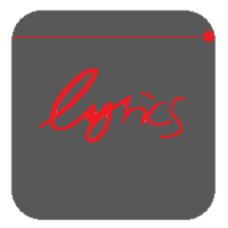

<div align="center">


# Browser Music Lyrics Overlay

</div>

## What is it?

This is a Music lyrics overlay application inspired by [Music-LAW-Lyrics-AnyWhere](https://github.com/iamdevdiv/Music-LAW-Lyrics-AnyWhere). It displays the current lyrics of the song you are playing in a browser tab.

## Features

- **Real-time Lyrics**: Displays synchronized lyrics for the current song.
- **Multi-Platform Support**: Works with both YouTube Music and Spotify.
- **Cross-Platform Compatibility**: Compatible with both Linux and Windows (Mac untested).
- **Minimalistic Overlay**: A clean and transparent overlay that stays on top of other windows.

## Installation

1. Clone the repository:
    ```sh
    git clone https://github.com/tony11306/youtube-music-lyrics-overlay.git
    cd youtube-music-lyrics-overlay
    ```

2. Install dependencies:
    ```sh
    npm install
    ```

3. Build the project:
    ```sh
    npm run build
    ```

## Usage

1. Start the Electron app:
    ```sh
    npm start
    ```

2. Load the browser extension:
    - Open Chrome and go to `chrome://extensions/`
    - Enable "Developer mode".
    - Click "Load unpacked" and select the `extension` folder from this project.

3. Open YouTube Music or Spotify in a new tab and play a song. The overlay window will display the current song's title, artists, and lyrics.